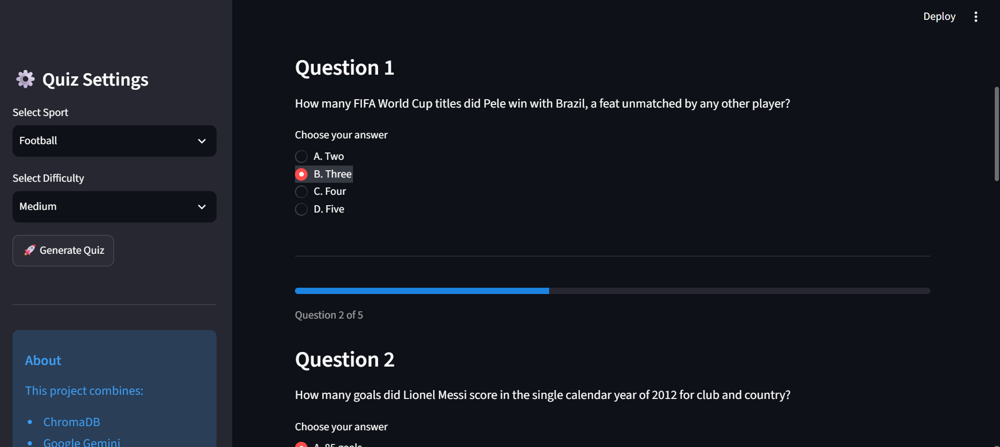
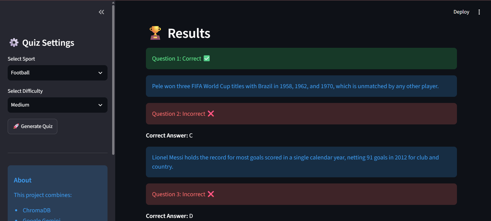
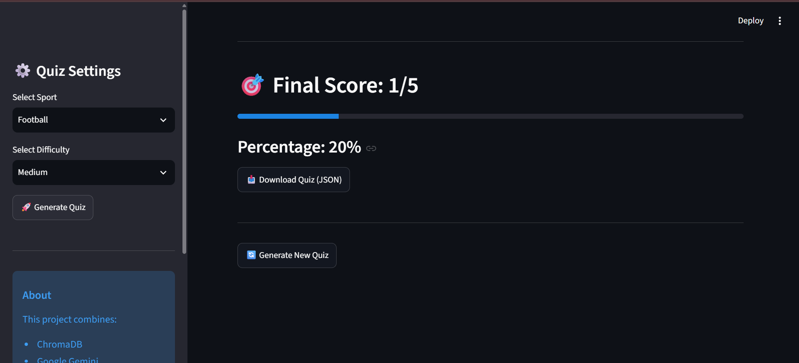

# AI Sports Quiz Generator

An AI-powered Sports Quiz Generator that creates dynamic multiple-choice quizzes by combining historical sports knowledge with live sports news using a Retrieval-Augmented Generation (RAG) pipeline.

The application retrieves relevant historical sports facts from a ChromaDB vector database, supplements them with the latest sports news using DuckDuckGo Search (DDGS), and uses Google Gemini to generate structured quiz questions. The generated quiz is presented through an interactive Streamlit interface.

---

## Live Demo

**Application:** https://sports-quiz-agent-jpzdk2j2kxg9jycbdqewdx.streamlit.app/

**GitHub Repository:** https://github.com/Amulyapriyaeamani/sports-quiz-agent

---

## Overview

This project demonstrates how Retrieval-Augmented Generation (RAG) can be used to build an intelligent question generation system.

Instead of relying only on an LLM, the application first retrieves semantically relevant historical sports facts from a vector database and combines them with current sports news retrieved from the web. This enriched context is passed to Google Gemini, which generates structured multiple-choice quiz questions in JSON format.

The Streamlit application then renders the quiz interactively, evaluates user responses, displays explanations, and calculates the final score.

---

## Features

- AI-powered quiz generation using Google Gemini
- Retrieval-Augmented Generation (RAG) architecture
- Semantic retrieval using ChromaDB
- Live sports news integration using DDGS (DuckDuckGo Search)
- Historical and real-time context fusion
- Interactive multiple-choice quiz interface
- Difficulty selection (Easy, Medium, Hard)
- Support for multiple sports
- Automatic answer evaluation
- Score calculation
- Explanation for every question
- Download generated quizzes in JSON format

---

## Technology Stack

| Technology | Purpose |
|------------|---------|
| Python | Backend Development |
| Streamlit | Web Interface |
| Google Gemini | Large Language Model |
| ChromaDB | Vector Database |
| DDGS | Live Sports News Search |
| Sentence Transformers | Text Embeddings |
| JSON | Structured Output |

---

## System Architecture

```text
                     User
                       │
                       ▼
              Streamlit Application
                       │
         Select Sport & Difficulty
                       │
                       ▼
              Generate Quiz Request
                       │
          ┌────────────┴────────────┐
          │                         │
          ▼                         ▼
 Historical Facts            Live Sports News
   (ChromaDB)                 (DDGS Search)
          │                         │
          └────────────┬────────────┘
                       ▼
            Context Aggregation
                       │
                       ▼
               Google Gemini API
                       │
          Structured JSON Response
                       │
                       ▼
        Interactive Quiz Interface
                       │
                       ▼
          Evaluation & Final Score
```

---

## Project Structure

```text
sports-quiz-agent/
│
├── app.py
├── requirements.txt
├── README.md
├── .env.example
├── .gitignore
│
├── data/
│   └── sports_facts.json
│
├── src/
│   ├── config.py
│   ├── database.py
│   ├── generator.py
│   └── search.py
│
├── chroma_db/
│
├── test_database.py
├── test_generator.py
└── test_search.py
```

---

## Workflow

1. The user selects a sport and difficulty level.
2. Relevant historical sports facts are retrieved from ChromaDB using semantic similarity search.
3. The latest sports news is fetched using DDGS.
4. Historical facts and live news are combined into a single prompt.
5. Google Gemini generates a structured JSON quiz.
6. Streamlit renders the quiz interactively.
7. User responses are evaluated.
8. The final score and explanations are displayed.
9. Users can download the generated quiz as a JSON file.

---

## Installation

### Clone the repository

```bash
git clone https://github.com/Amulyapriyaeamani/sports-quiz-agent.git

cd sports-quiz-agent
```

### Create a virtual environment

**Windows**

```bash
python -m venv .venv

.venv\Scripts\activate
```

**macOS / Linux**

```bash
python3 -m venv .venv

source .venv/bin/activate
```

### Install dependencies

```bash
pip install -r requirements.txt
```

### Configure the environment

Create a `.env` file in the project root.

```env
GEMINI_API_KEY=YOUR_GEMINI_API_KEY
```

For Streamlit Community Cloud, add the API key under **App Settings → Secrets**.

---

## Running the Application

Launch the Streamlit application.

```bash
streamlit run app.py
```

Open your browser and navigate to:

```
http://localhost:8501
```

---

## Usage

1. Open the application.
2. Select a sport.
3. Choose a difficulty level.
4. Click **Generate Quiz**.
5. Answer all multiple-choice questions.
6. Submit the quiz.
7. Review the score and explanations.
8. Download the generated quiz as JSON if required.

---

## Sample Retrieval-Augmented Generation Pipeline

```
User Query
      │
      ▼
Retrieve Historical Facts (ChromaDB)
      │
      ▼
Retrieve Latest Sports News (DDGS)
      │
      ▼
Combine Context
      │
      ▼
Google Gemini
      │
      ▼
Generate Structured JSON Quiz
      │
      ▼
Interactive Streamlit Quiz
```

---

## Screenshots

### Home Page


### Generated Quiz



### Quiz Results



### Score 


---

## Future Improvements

- Add more sports categories
- Timer-based quiz mode
- User authentication
- Leaderboard and score history
- Adaptive difficulty
- Personalized quiz recommendations
- PDF export
- Database-backed user history
- Cloud deployment with persistent storage

---

## Author

**Amulya Priya Eamani**

GitHub: https://github.com/Amulyapriyaeamani

LinkedIn: https://www.linkedin.com/in/amulyapriyaeamani/


---

## License

This project was developed for educational, portfolio, and demonstration purposes.
